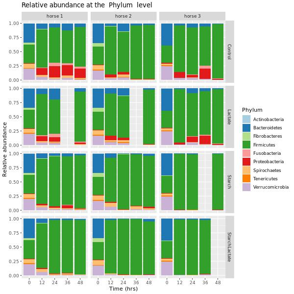

# Dataprocessing: a snakemake workflow 

A workflow in snakemake to classify taxomomic levels of metagenomic Illumina 16S rRNA (V4 region) data derived from horse gut microbiome.

## Requirements

- [snakemake version 6.1.0](https://snakemake.readthedocs.io/en/v6.1.0/index.html)
  - [Instructions for installation](https://snakemake.readthedocs.io/en/v6.1.0/getting_started/installation.html)
- [sra toolkit version 2.11.0](https://github.com/ncbi/sra-tools/releases/tag/2.11.0)
  - [Instructions for installation](https://github.com/ncbi/sra-tools/wiki/02.-Installing-SRA-Toolkit) (don't forget to replace current with 2.11.0)
- [qiime2 version 2021.2](https://docs.qiime2.org/2021.2/)
  - [Instructions for installation](https://docs.qiime2.org/2021.2/install/)
- [R version 4.0.3](https://cran.r-project.org/bin/windows/base/old/4.0.3/)
  - [Instructions for installation](https://cran.r-project.org/bin/windows/base/old/4.0.3/README.R-4.0.3)
- [ggplot2 version 3.3.3](https://github.com/tidyverse/ggplot2/)
- [stringr version 1.4.0](https://github.com/tidyverse/stringr)

## Usage

### Installation

If you want to use this workflow, download and extract this repository and install the requirements.

### Configure workflow

Configure the workflow according to your needs via editing the file `config.yaml`

The file looks like this:

```
data_location: "data/"
output_location: "output/"
log_location: "logs/"

denoising_params:
  trunc-len-f: 150
  trunc-len-r: 150
  trim-left-f: 13
  trim-left-r: 13
  trunc-q: 0
  chimera-method: 'pooled'
  pooling-method: 'pseudo'

barplot_params:
  taxonomic_level: "Phylum"
  percentage_present_in_sample: 0.5
  filename: "barplot.jpg"
  width: 600
  height: 600
  filter: "Kingdom=Bacteria"
```

#### data_location
The `data_location` is the location where the data files that are needed for this workflow are stored. The path to this directory is relative to where the workflow is executed In this folder there should be three files:

- SRR_Acc_List.txt
- SraRunTable.txt
- classifier.qza

SRR_Acc_List.txt and SraRunTable.txt can be downloaded from the NCBI SRA run selector. The ones used in the example on this repository can be found [here](https://www.ncbi.nlm.nih.gov/Traces/study/?query_key=1&WebEnv=MCID_606c376c304b23742a42ed89&o=acc_s%3Aa). 

The classifier is a Qiime2 artifact, the one used in this workflow is the Greengenes 13_8 99% OTUs from 515F/806R region of sequences trained by Qiime2, it can be downloaded [here](https://docs.Qiime2.org/2021.2/data-resources/#taxonomy-classifiers-for-use-with-q2-feature-classifier)

#### output_location
The `output_location` is the folder where the generated data and visualizations are stored. The path to this directory is relative to where the workflow is executed

#### log_location
The `log_location` is the folder where the logs generated by this workflow will be stored. The path to this directory is relative to where the workflow is executed

#### denoising_params
The `denoising_params` are the parameters used for the `qiime dada2 denoise-paired` that is executed in this workflow. For more information on these parameters go to [Qiime2 documentation](https://docs.qiime2.org/2021.2/plugins/available/dada2/denoise-paired/)

#### barplot_params

The `barplot_params` are the parameters that are given to the R script that will generate the final barplot visualization of this workflow. 

The `taxonomic_level` is the taxonomic level that will be shown in the barplot. E.g. if the taxonomic level is set to `"Phylum"` the different phyla represented in the data will be shown in different colors in the barplot.

The `percentage_present_in_sample` is the minimum percentage a taxonomic unit has to be present in one of the samples at any one timepoint or treatment method to be shown in the barplot.

The `filename` is self explanatory, this is the filename to which the barplot will be saved to. The file will be found in the output folder.

The `width` and `height` are the width and height in pixels that the barplot will be saved at.

The `filter` should always be in the format `{taxonomic_level={taxonomic_unit}}`. The data that will be displayed in the plot will only be that is assigned to the taxonomic unit in this filter parameter.


### Execute workflow

Navigate to the correct folder via the command line. Folders `WC-02` to `WC-05` contain the assignments done for the tutorials from weeks 2 to 5. The folder called `final` contains the final assignment (the horse gut workflow). Each of these folders contain a snakefile that can be run by executing

```
snakemake --cores $N
```

Where `$N` is the number of cores you want to use.

When executing the final workflow it is advised to first run

```
snakemake --cores $N quality_check_qiime
```

This will download the SRA files with the accession number in the `SRR_Acc_List.txt`, make a Qiime2 artifact with these files (called `paired-end-demux.qza`, found in `output/qiime_artifact`). And make a visualization of the quality of the reads. This visualization is stored in `output/quality_check/visualization.qzv`. This is an archive with a folder called `data`, this folder has a file called `index.html`. Going to this file in yout browser you get an overview of the quality of the reads in your data. If you click on the tab *Interactive Quality Plot* you can see two interactive plots. On the left hand side an interactive plot that shows the quality of the forward reads and on the right hand side a plot the quality of the reversed reads. Based on the information on this page you can adjust the `denoising_params` parameters in the configuration file. When adjusting the `trunc-len-f` and `trunc-len-r` parameters please keep in mind that the reads still need to overlap at with least 12 basepairs to continue with the rest of the workflow.

After adjusting the `denoising_params` to your needs you can go ahead and execute the rest of the workflow by running the following command

```
snakemake --cores $N
```

Running this will give you the end product of the workflow, a barplot with the taxonomic classification of the sequences in your data. An example is given below.



If running the workflow results in an error while making the barplot, please check the `output/denoising/denoising-stats.qza` archive. In this archive you will find a data folder with a `stats.tsv` file. Here you can check how many reads were filtered out by the denoising step. If there are too little reads left this might result in problems in the rest of the workflow. If this is the case readjust the `denoising_params` and try to run the workflow again.

## Support

n.j.hindriks@st.hanze.nl

## Author

Naomi Hindriks

## License
This is free and unencumbered software released into the public domain.

Anyone is free to copy, modify, publish, use, compile, sell, or
distribute this software, either in source code form or as a compiled
binary, for any purpose, commercial or non-commercial, and by any
means.

In jurisdictions that recognize copyright laws, the author or authors
of this software dedicate any and all copyright interest in the
software to the public domain. We make this dedication for the benefit
of the public at large and to the detriment of our heirs and
successors. We intend this dedication to be an overt act of
relinquishment in perpetuity of all present and future rights to this
software under copyright law.

THE SOFTWARE IS PROVIDED "AS IS", WITHOUT WARRANTY OF ANY KIND,
EXPRESS OR IMPLIED, INCLUDING BUT NOT LIMITED TO THE WARRANTIES OF
MERCHANTABILITY, FITNESS FOR A PARTICULAR PURPOSE AND NONINFRINGEMENT.
IN NO EVENT SHALL THE AUTHORS BE LIABLE FOR ANY CLAIM, DAMAGES OR
OTHER LIABILITY, WHETHER IN AN ACTION OF CONTRACT, TORT OR OTHERWISE,
ARISING FROM, OUT OF OR IN CONNECTION WITH THE SOFTWARE OR THE USE OR
OTHER DEALINGS IN THE SOFTWARE.

For more information, please refer to <https://unlicense.org>